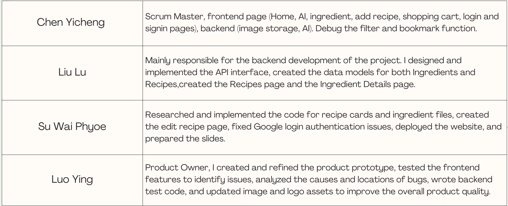

### Frontend code 
- https://github.com/chenyicheng1998/Web-Project/tree/Dev/Web-Project-FE

### Backend code
- https://github.com/chenyicheng1998/Web-Project/tree/Dev/Web-Project-BE

### render link
- https://web-project-nlhn.onrender.com

### Sprint Ceremony Insights

#### Daily Scrum 
We met regularly to talk about what we finished, what we planned next, and any problems we ran into. We’ve definitely improved in communicating and staying on track compared to the earlier sprints.

- https://metropoliafi-my.sharepoint.com/:w:/g/personal/suph_metropolia_fi/EfwWN32So3JIqJv2NBxYm_MBgVCWYaNjTbgNONlyyG1FwA?e=vBuqoP

#### Sprint Review
It went really well and got a lot of positive  feedbacks from the classmates and teacher.

#### Sprint Retrospective
- Liked: Team collaboration, completed front-end/back-end connection , deploying
- Learned: How to integrate AI recommendations and Google OAuth.
- Lacked: More thorough testing earlier in the sprint.
- Longed For: More time for testing and polishing the UI before the demo.

Team Contribution

### Presentation slides

- https://www.canva.com/design/DAG1HU5DllM/SqR984BwUMa5y1FD0O5N6Q/edit?utm_content=DAG1HU5DllM&utm_campaign=designshare&utm_medium=link2&utm_source=sharebutton

### Self-Assessment of Backend

- https://github.com/chenyicheng1998/Web-Project/blob/self-assessments/self-assessmentofBackend.md

### Self-Assessment of Frontend

- https://github.com/chenyicheng1998/Web-Project/blob/self-assessments/self-assessmentofFrontend.md
